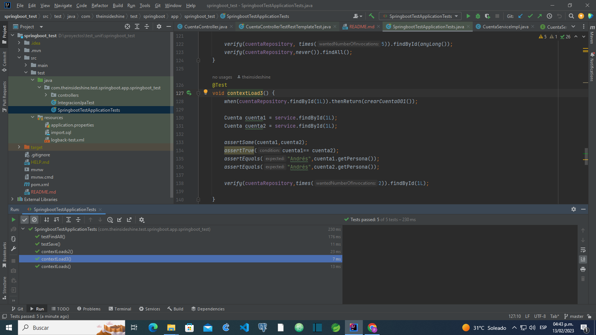
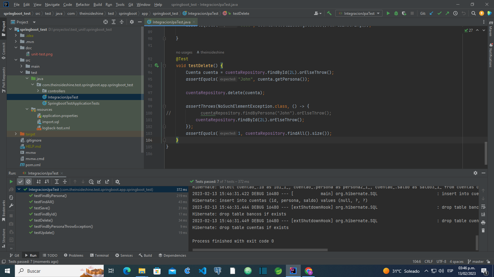
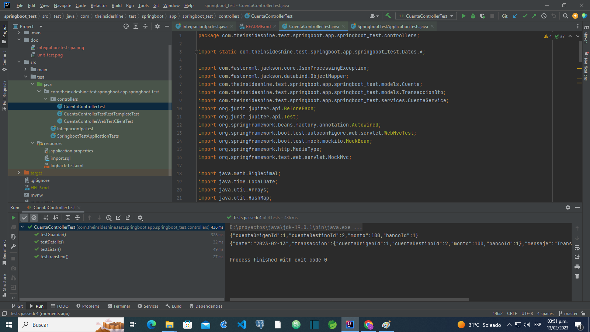
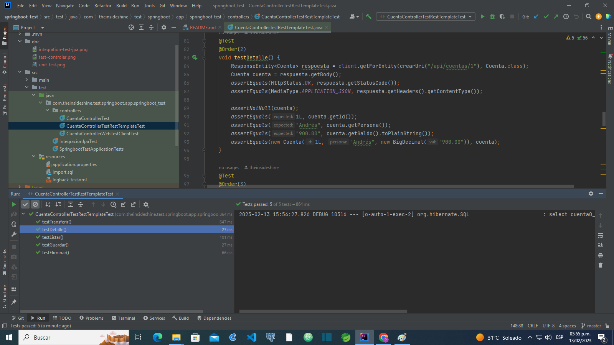
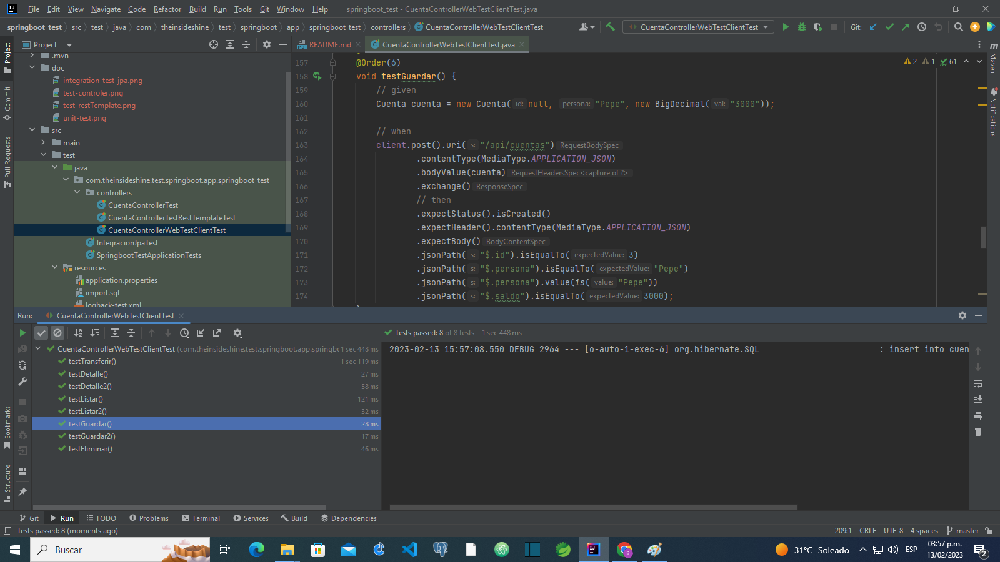
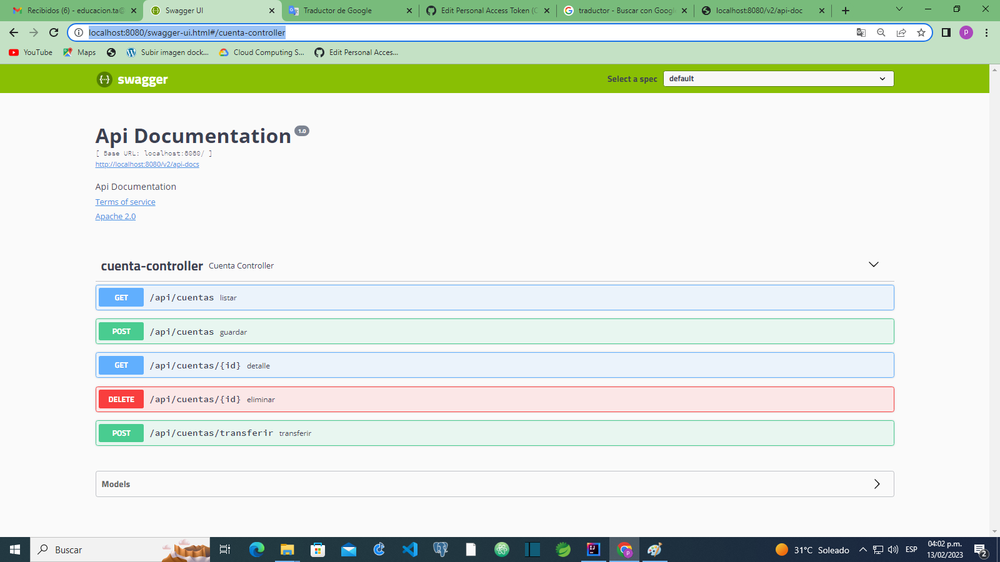

integration-and-unit-tests

The intention of this project is to learn the basic use of Junit5 and Mockito for unit and integration tests.

 
 
SpringbootTestApplicationTest.java-
Unit testing methods and components using mockito

 
 
IntegrationJpaTest.java-
tests on the repository with jpa

  
CuentaControllerTest.java-
controller unit tests
  

CuentaControllerTestRestTemplate.java-
integration tests using restTemplate as server

CuentaControllerWebTestClient.java-
integration tests using WebTestClient as server

Use of swagger

